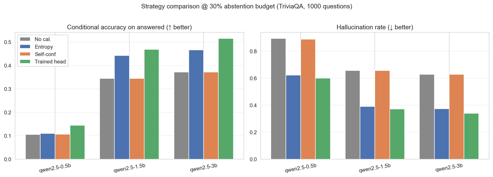
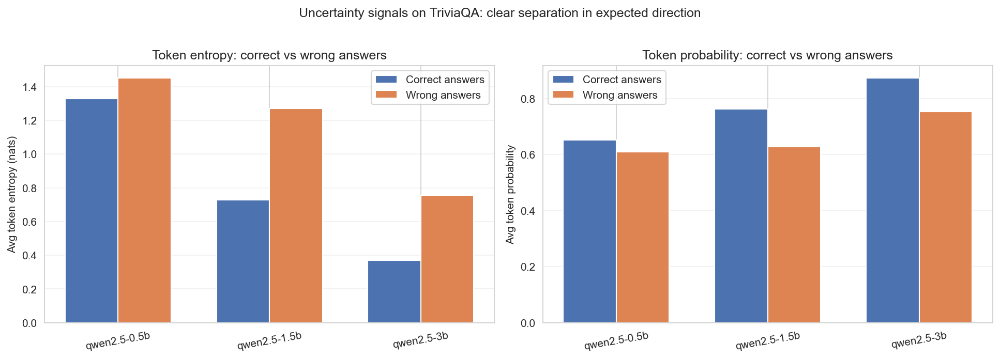
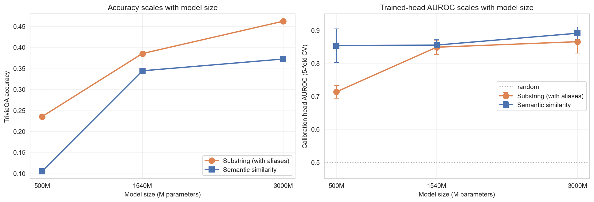
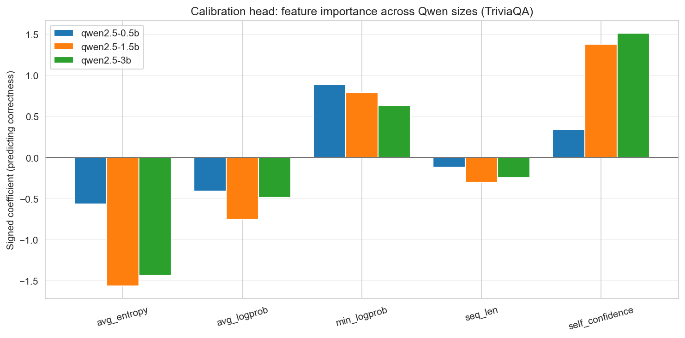
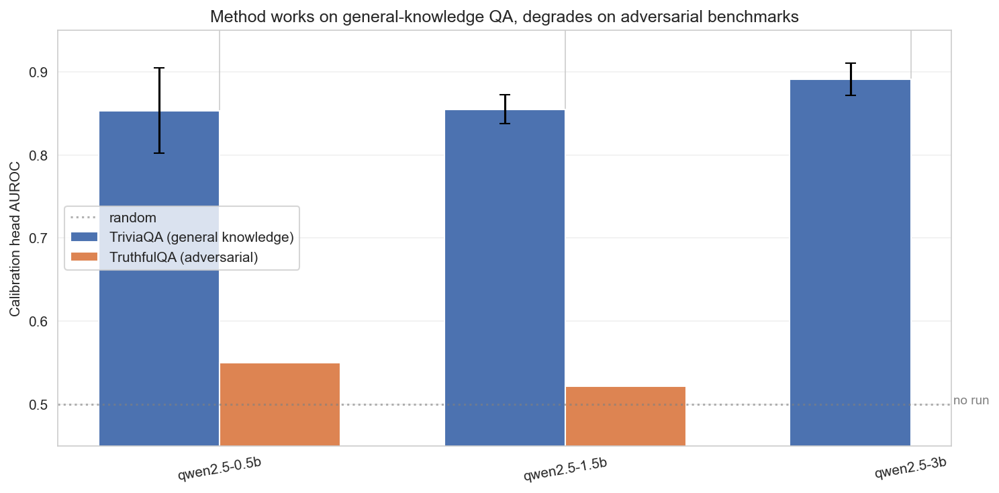

# Detecting Hallucinations in Small Open-Source LMs

Can a small language model tell when it's wrong? On general-knowledge QA, yes — a single logistic-regression layer on top of token-level uncertainty signals hits **AUROC 0.85–0.89** for correctness prediction across three Qwen2.5 sizes, with no LM fine-tuning.

**Course project for STAT 453 (Deep Learning), Spring 2026, UW–Madison.**

## TL;DR

Three instruction-tuned Qwen2.5 models (0.5B, 1.5B, 3B) evaluated on 1000 TriviaQA questions:

- Token-level **average entropy is consistently higher on incorrect answers** than on correct ones, and **average token probability is higher on correct ones** — the signal is there in the per-token statistics, it just needs to be combined.
- A **logistic-regression calibration head** trained on five summary uncertainty features (avg-entropy, avg-logprob, min-logprob, sequence length, self-reported confidence) achieves **AUROC ≈ 0.85 / 0.86 / 0.89** for the three model sizes (5-fold CV).
- At a fixed 30% abstention budget, the trained head **cuts the hallucination rate from 0.66 → 0.38 on Qwen-1.5B and 0.63 → 0.36 on Qwen-3B**, and beats both single-signal baselines (entropy-only, self-confidence-only) across all three sizes.
- Self-confidence is the dominant predictive feature for the 1.5B and 3B models; for the 0.5B model it's nearly useless and `min_logprob` carries most of the signal — calibration-of-self-confidence appears to be an emergent capability of scale.
- The method **generalizes to general-knowledge QA but degrades to near-random (AUROC ≈ 0.52–0.55) on adversarial benchmarks like TruthfulQA** — see Limitations.
- Full pipeline runs in **~3 GPU-hours on a free Colab T4**.



## What's in this repo

| File | Purpose |
|---|---|
| [`hallucination_detection.ipynb`](hallucination_detection.ipynb) | Main Colab notebook — runs the full experiment end-to-end |
| [`build_report_assets.py`](build_report_assets.py) | Generates figures from the notebook's JSON output |
| `report_assets/figures/` | All figures generated from the experimental results |
| `report_assets/triviaqa_summary.json` | Consolidated metrics from the TriviaQA run (primary) |
| `report_assets/final_summary.json` | Consolidated metrics from the TruthfulQA stress-test run |

## Method, in one diagram

```
                    TriviaQA (1000 Qs)
                           │
                           ▼
                  Open-ended generation
                           │
              ┌────────────┼────────────┐
              ▼            ▼            ▼
         avg entropy  avg log-prob  min log-prob
              │            │            │
              └────────────┼────────────┘
                           │
              ┌────────────┴────────────┐
              ▼                         ▼
        seq length              self-conf prompt
              │                         │
              └────────────┬────────────┘
                           ▼
              Five-feature calibration head
              (logistic regression, balanced weights, 5-fold CV)
                           │
                           ▼
              correctness label: substring + semantic similarity
                           │
                           ▼
        Compare 4 policies @ 30% abstention budget:
        no-cal | entropy | self-conf | trained head
```

## Reproducing the experiments

### Option A — full reproduction (Colab, ~3 GPU-hours)

1. Open [`hallucination_detection.ipynb`](hallucination_detection.ipynb) in Google Colab.
2. **Runtime → Change runtime type → T4 GPU** (the free tier is sufficient).
3. Run all cells. The long-running cell is the per-model evaluation loop.
4. Results are written to `MyDrive/stat453_project/results/` — the key files are `triviaqa_summary.json` and `final_summary.json`.

### Option B — regenerate figures only (~30 seconds, CPU)

If you have the summary JSONs in `report_assets/`, just run:

```bash
python3 -m pip install numpy matplotlib seaborn
python3 build_report_assets.py
```

Figures are written to `report_assets/figures/`.

## Key design choices

- **Three Qwen sizes spanning ~6× in parameters.** 0.5B / 1.5B / 3B lets us check whether calibration-head quality and feature importance shift with scale within a single instruction-tuned family, while keeping the whole pipeline runnable on a free Colab T4.
- **Two correctness labelers, run in parallel.** Substring matching with TriviaQA's answer aliases is strict but precision-leaning; sentence-embedding semantic similarity (all-MiniLM-L6-v2, cosine ≥ 0.65) catches paraphrases. Both labels are reported throughout, and the calibration head is trained against each.
- **A trained calibration head, not just thresholds.** Entropy thresholds use one signal; self-confidence thresholds use one signal. A five-feature logistic regression beats both by combining them, and trains in seconds on CPU. This is the only component of the pipeline that involves any training.

## Findings, as plots

### Uncertainty signals separate correct from wrong answers
Token entropy is higher and token probability is lower on wrong answers — across all three model sizes.


### The trained head outperforms single-signal abstention rules
At a 30% abstention budget, the trained head achieves the highest answered-question accuracy and the lowest hallucination rate for every model size.


### Both accuracy and calibration-head AUROC scale with model size
Going from 500M to 3B parameters lifts TriviaQA accuracy from ~0.23 to ~0.46 (substring) and trained-head AUROC from ~0.85 to ~0.89.


### Self-confidence dominates the head — but only at scale
For the 0.5B model, self-reported confidence is nearly useless and `min_logprob` carries the signal. For 1.5B and 3B, self-confidence becomes the largest positive coefficient. Asking a small model "how sure are you?" is a feature that earns its keep only after a certain scale.


### The method works on general-knowledge QA, but not on adversarial benchmarks
Running the same pipeline on TruthfulQA (designed to elicit confident wrong answers) drops the calibration head to near-random (AUROC ≈ 0.52–0.55). Uncertainty signals alone aren't enough when the model is **confidently wrong by design**.


## Limitations

- **Adversarial robustness is poor.** On TruthfulQA the trained head barely beats random. Token-level uncertainty doesn't capture the kind of error TruthfulQA is built to surface (overconfident, fluent, plausibly-phrased misinformation), and the head likely needs hidden-state features to do better.
- **One model family.** All three models are Qwen2.5-Instruct. Whether the same scaling pattern of self-confidence usefulness holds for other instruction-tuned families is open.
- **Greedy decoding only.** No sampling-based uncertainty (Monte Carlo agreement, semantic-cluster entropy, etc.), which prior work has shown to be strong.
- **Automatic correctness labels are imperfect.** Both substring matching with aliases and semantic similarity introduce label noise; manual audit on a subset would tighten the AUROC numbers in either direction.
- **Logistic regression head.** An MLP probe over hidden states would be a natural next step and might recover some of the lost adversarial-benchmark performance.

## Citation / contact

If you found this useful: Rohan Chakravarthi, `rchakravart4@wisc.edu`. UW–Madison.

## Acknowledgements

Built with [HuggingFace Transformers](https://github.com/huggingface/transformers), [sentence-transformers](https://github.com/UKPLab/sentence-transformers), [TriviaQA](https://nlp.cs.washington.edu/triviaqa/), and [TruthfulQA](https://github.com/sylinrl/TruthfulQA).
